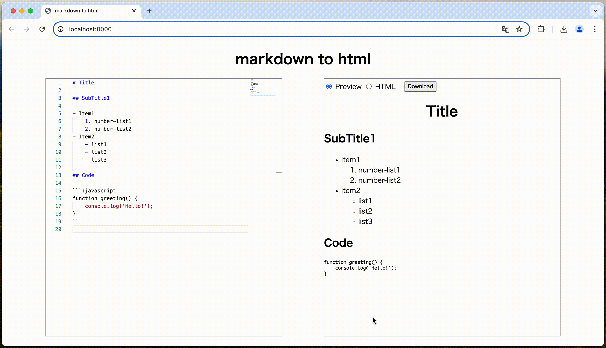

# markdown-to-html


## URL

https://mdtohtml.d-andoh.com/

## About

このプログラムは、マークダウンをHTMLにリアルタイムで変換します。
変換されたHTMLは、ページ、ソースコードそれぞれの形式でプレビュー表示されます。
また、HTMLファイルのダウンロードも可能です。

## Demo



## Development

```
$ cd markdown-to-html
$ composer install
$ php -S localhost:8000
```
